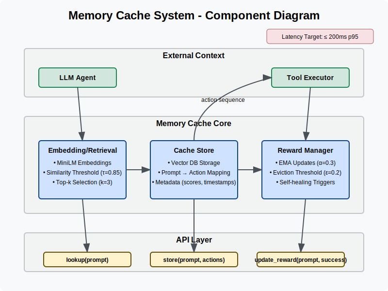
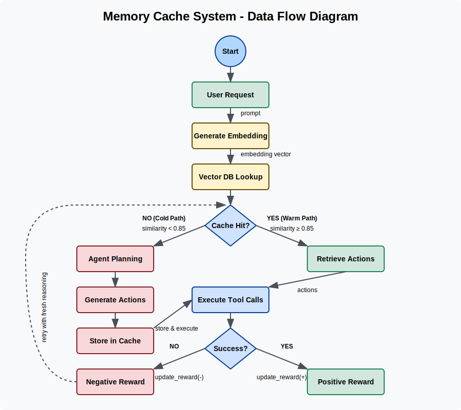

# AI Agent Memory Cache

The memory cache system provides a fast retrieval method for LLM agent tool sequences, enabling repeated requests to be fulfilled instantly without re-planning.

## System Diagrams

### Component Architecture


### Data Flow


## 1. Objective

Build a memory‑cache layer that remembers the exact sequence of tool calls (plan & execution) an LLM agent used to satisfy a user request in a video‑game development context, so repeated or very similar requests can be fulfilled instantly without re‑planning. The cache must support reward/penalty updates so the agent can learn when a stored plan is obsolete or wrong and replace it with a better sequence.

## 2. Background & Motivation

When the agent receives a prompt like "Make the player move faster" it usually:

1. Uses RAG to locate the code section that controls player movement speed.
2. Calls a code‑editing tool.
3. Confirms the change.

Planning & reasoning in step 1 are expensive (~seconds, extra tokens). Caching the successful plan means that if the same (or semantically equivalent) request comes later, we can skip step 1 and re‑play the stored actions. If the cached sequence ever fails (file moved, variable renamed) the agent should fall back to reasoning, discover a new plan, and update the cache.

## 3. Functional Requirements

| ID | Requirement |
|----|-------------|
| FR‑1 | lookup() must return a stored action sequence when the incoming prompt is semantically similar to a cached key above a similarity threshold. |
| FR‑2 | When lookup() misses, the agent will generate a new plan and call store() with the prompt + sequence. |
| FR‑3 | After each execution, the agent calls update_reward(prompt, success) to reinforce or penalize the cached entry. |
| FR‑4 | When an entry's score drops below ε or a tool failure is detected, the cache should mark the entry stale so the next access triggers re‑planning. |
| FR‑5 | The API must be thread‑safe; multiple agent instances may share one store. |
| FR‑6 | Must support ≥ 10k entries with ≤ 200 ms p95 lookup on a laptop‑class CPU. |

## 4. Non‑Functional Requirements

- **Latency:** warm‑path ≤ 200 ms (including embedding & DB round‑trip).
- **Scalability:** allow migrating the vector store to a remote DB (Chroma, Pinecone) without API changes.
- **Observability:** emit structured logs for hit/miss, reward updates, eviction.
- **Portability:** pure Python 3.10+, no GPU assumed.

## 5. Glossary

- **Prompt:** Original user message (post‑system & context).
- **Action sequence:** Ordered list of {tool_name, arguments} objects executed by the agent.
- **Reward score:** Floating‑point quality metric updated after each run.

## 6. High‑Level Architecture

Inside the memory cache:

1. **Embedder** converts prompt → vector.
2. **Similarity Search** queries Vector DB and returns the top‑k matches.
3. **Hit?** 
   - YES → action sequence goes directly back to the Agent (warm path).
   - NO → Agent enters Reasoning/Planning block, generates new actions, executes them via Tool Executor, then calls store() to save {prompt, embedding, sequence, score=1.0} into Vector DB + Meta KV.
4. After execution, Agent calls update_reward() which updates the score and triggers Eviction Manager if score < ε.

## 7. Data Model

| Field | Type | Notes |
|-------|------|-------|
| id | UUID | Primary key. |
| prompt_raw | TEXT | Original prompt string. |
| embedding | FLOAT[768] | L2‑normalised MiniLM embedding. |
| actions | JSONB | [ {tool, args, ts_exec}, … ] |
| score | FLOAT | Starts at 1.0, EMA update. |
| created_at | TIMESTAMP | First insertion. |
| updated_at | TIMESTAMP | Last reward update. |

## 8. Core Algorithms

### 8.1 Similarity‑based Lookup

```
q ← embed(prompt)
results ← vector_db.query(q, top_k=3)
if cosine(q, results[0]) ≥ τ   // τ ≈ 0.85
    return results[0].actions
else
    return None           // cold path
```

### 8.2 Reward Update & Eviction

```
score_new = α*success + (1‑α)*score_old
if score_new < ε:
    mark entry as STALE (skip until re‑stored)
```

Typical values: α = 0.3, ε = 0.2.

### 8.3 Self‑Healing

On tool failure the agent does:

1. update_reward(prompt, success=False) → score halves.
2. Retry with fresh reasoning; on success call store() which overwrites the old entry (same prompt hash).

## 9. Public API (Python)

```python
class MemoryCache:
    def lookup(self, prompt: str) -> Optional[List[ToolCall]]: ...
    def store(self, prompt: str, actions: List[ToolCall]) -> None: ...
    def update_reward(self, prompt: str, success: bool) -> None: ...
```

(ToolCall is a TypedDict with tool: str, args: dict)

## 10. Configuration / Tunables

| Parameter | Default | Rationale |
|-----------|---------|-----------|
| model_name | all‑MiniLM‑L6‑v2 | Fast CPU embeds. |
| τ (similarity threshold) | 0.85 | Balances precision / recall. |
| α (EMA factor) | 0.3 | Smooths noisy outcomes. |
| ε (evict score) | 0.2 | Purges bad plans. |
| top_k | 3 | Increases robustness to prompt wording. |

## 11. Failure Scenarios & Mitigations

| Scenario | Mitigation |
|----------|------------|
| Vector DB unavailable | Fallback to in‑mem list + log warning. |
| Embedding model download fails | Retry w/ exponential back‑off; cache local copy. |
| Tool signature changes | Low reward from repeated failures triggers re‑planning. |
| Prompt drift (near‑miss lookups) | Threshold tuning & top‑k consensus reduce false positives. |

## 12. Security / Permissions

- Store only minimal prompt text—strip PII if required.
- Running in developer's local environment; if deployed remotely, secure Vector DB with API keys and TLS.

## 13. Testing Strategy

- Unit tests for embedding, lookup threshold, reward math.
- Integration test simulating an agent editing a dummy file twice: first run cold, second warm.
- Chaos test injecting tool failure → expect reward drop and cache overwrite.

## 14. Future Extensions

- Cross‑prompt generalisation – cluster prompts into intents, store one canonical plan per cluster.
- Multi‑modal embeddings – include file paths or code snippets so edits to the same variable in different files map correctly.
- Dashboard – real‑time chart of hit‑rate and average latency.
- Language bindings – thin TypeScript wrapper for Node agents.